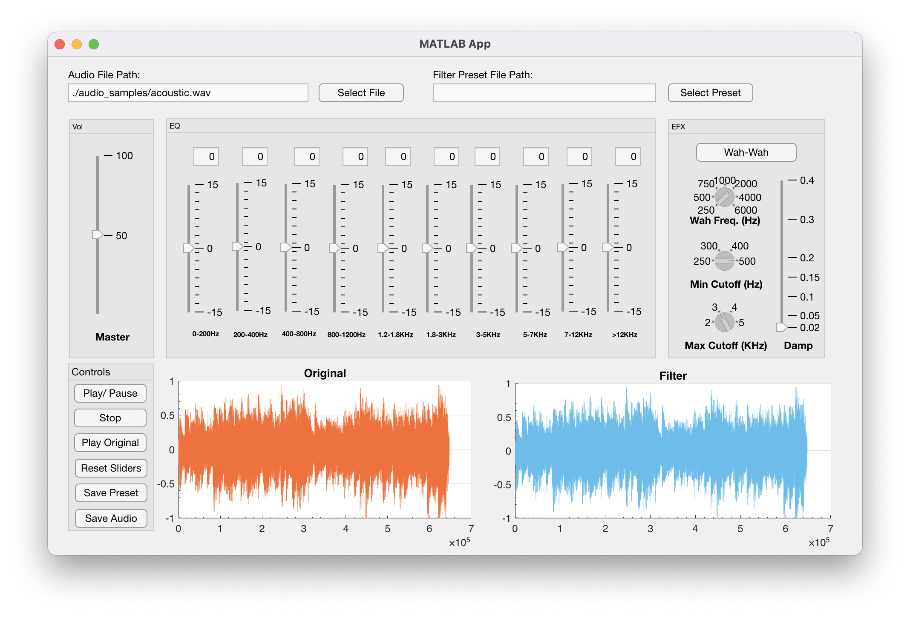

# Mlab-Graphical-Equalizer
Multiband eq made with matlab. Eq achieved through using IIR shelving and peaking filters. Includes wah wah effect, playback, saving audio, loading audio and saving presets.

[🔗 Implementation Report](./Report.pdf)

